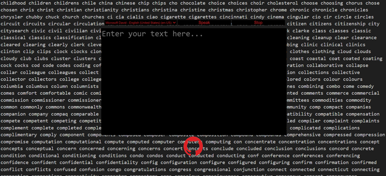

# text-to-speech-webpage

<a href="https://ip-repo.github.io/text-to-speech-webpage/">View Text To Speech Webpage</a>

This webpage allow user to type text and click on a button to speak it.

This webpage uses the Web Speech API's text-to-speech functionality but the availability of different voices and languages can vary based on several factors, including the protocol used to access the webpage and the browser’s implementation of the API.

The implemnation of the Web Speech API can differ between browsers and that can effect the functionality and the amount of voices that the browser offer.

When accessing the webpage via `HTTP` protocol the broswer can access more voices provided by the os or installed language packs.

`file:///` protocol or `online` hosting on the other hand may have restricitions or limitations, some browsers my limit the voices to a default set when not served over `HTTP` or `HTTPS` protocol.

Note: the webpage can be used locally without internet connection but the Web Speech API will offer a limited amount of voices because the broswer may default to using the voices that are locally installed.
Many of the additional voices that are available online are provided through cloud-based services.. which requires internet connection.

For example, in Edge browser the web tts api can access a wide range of voices from Microsoft's servers when you are online. However, when offline its uses only the voices installed locally. 

<a href="https://developer.mozilla.org/en-US/docs/Web/API/Web_Speech_API/Using_the_Web_Speech_API">More on Web Speech API</a>
